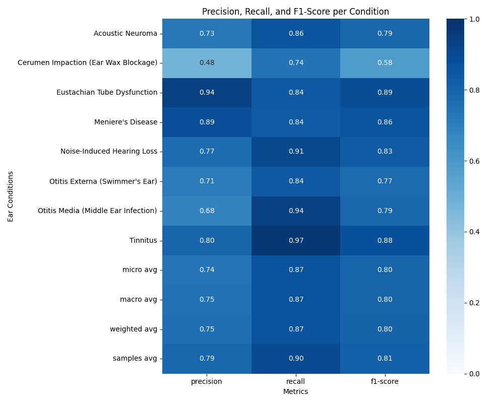
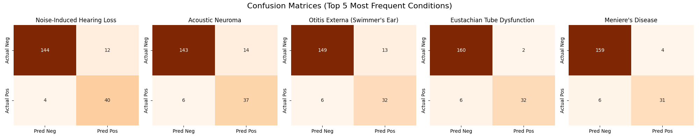
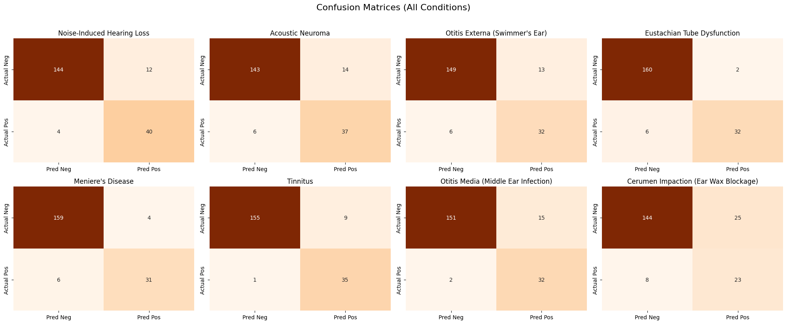

# Audiology NLP Pipeline: Patient Narratives to Clinical Insights

An end-to-end Machine Learning NLP pipeline designed to ingest unstructured, colloquial patient descriptions and output structured clinical symptoms and predicted audiological conditions.

This system handles typos, medical negation, and semantic matching to act as a highly sensitive triage and structuring tool for audiologists.

## 🏗️ System Architecture

The pipeline consists of four sequential stages:
1. **Data Ingestion & Cleaning:** Corrects typos, expands abbreviations, normalizes colloquial phrases (e.g., "leaking fluid" $\rightarrow$ "fluid_discharge"), and strips irrelevant stopwords while strictly preserving negation contexts.
2. **Symptom Extraction (Hybrid Approach):** Uses exact dictionary matching alongside contextual Noun-Chunking to prevent hallucination.
3. **Semantic Feature Encoding:** Utilizes a domain-adapted, fine-tuned **Sentence-BERT (SBERT)** model to convert phrases into dense 384-dimensional mathematical vectors.
4. **Multi-Label Classification:** Applies a One-vs-Rest Logistic Regression model to predict overlapping conditions (e.g., a patient having both *Tinnitus* and *Otitis Media* simultaneously) based on probability thresholds.

---

## 📂 Repository Structure

The project strictly separates domain knowledge (JSON templates) from code logic and model weights.

```text
.
├── dataset/
│   ├── audiology_dataset.json           # Raw synthetic patient descriptions
│   └── clean_audiology_dataset.json     # Processed and normalized text
├── evaluation/
│   ├── classification_heatmap.png       # Precision/Recall/F1-score per condition
│   ├── top_5_confusion_matrices.png     # 2x2 matrices for highest frequency conditions
│   ├── all_confusion_matrices.png       # Complete matrix grid
│   └── metricsReport.txt                # Raw sklearn output
├── models/
│   ├── fine_tuned_audiology_sbert/      # Fine-tuned Hugging Face transformer
│   ├── audiology_lr_classifier.pkl      # Trained Logistic Regression weights
│   └── audiology_label_binarizer.pkl    # MultiLabelBinarizer for target classes
├── templates/
│   ├── canonicalSymptoms.json           # Master list of standard medical symptoms
│   ├── conditionSymptomMap.json         # Clinical truth mapping diseases to symptoms
│   ├── possibleConditions.json          # Master list of audiological diseases
│   ├── relevantStopwords.json           # Stopwords to explicitly RETAIN (e.g., "not")
│   ├── symptomNormalizations.json       # Slang/Colloquial mappings
│   └── typos.json                       # Common spelling errors mapped to corrections
└── Pipeline.ipynb / pipeline.py         # Unified object-oriented inference engine

```

---

## 🧠 Technical Rationale & Model Selection

### 1. Why Sentence-BERT (SBERT) over TF-IDF or Word2Vec?

Standard embedding models like TF-IDF treat text as a "bag of words," ignoring sentence structure. Averaged Word2Vec loses nuance in longer sentences.
In clinical text, the sequence and context are everything. SBERT understands that "ear feels blocked" and "stuffed up ear" occupy the same semantic space even if they share zero identical characters.

* **Fine-Tuning:** We fine-tuned `all-MiniLM-L6-v2` using **Contrastive Learning** (`MultipleNegativesRankingLoss`) on our `conditionSymptomMap.json`. This forcibly adapted the general English model to the audiological domain, pulling clinical symptoms and their corresponding conditions closer together in the vector space.

### 2. Why Logistic Regression over Random Forest?

While Random Forests are powerful, tree-based models make axis-aligned splits. They struggle fundamentally with dense, distributed, high-dimensional continuous embeddings (like SBERT's 384 dimensions). **Logistic Regression** effectively draws hyperplanes through this dense vector space, trains in seconds, and adds virtually zero latency during API inference.

---

## 🚧 Engineering Challenges Solved

### The "Disappearing Not" (Medical Negation)

**The Problem:** Standard NLP cleaning steps aggressively remove stopwords. If a patient said, *"my ear is not causing burning pain"*, the cleaner erased `"not"`, feeding `"causing ear_pain"` to the model, which naturally extracted the pain symptom (a catastrophic hallucination).
**The Solution:** 1. We modified the spaCy pipeline to explicitly ignore our `relevantStopwords.json` list.
2. We implemented a **3-Word Look-Back Trap** during extraction. The pipeline scans up to 3 tokens behind any detected symptom for negation words (jumping over filler words like "causing" or "is"). If a negation is found, the symptom is immediately discarded before reaching the SBERT semantic matcher.

### The Underscore Tokenization Bug

**The Problem:** Normalizing text to `muffled_hearing` caused spaCy's chunker to treat the entire string as a single unrecognized entity, breaking part-of-speech tagging and causing compounding replacement bugs.
**The Solution:** We implemented regex word boundaries (`\b`) during normalization to prevent cascading string replacements, and ensured the exact-matcher processed human-readable strings while SBERT processed the normalized versions.

---

## 📊 Model Evaluation & Results

Because medical triage should prioritize catching illnesses over falsely dismissing them, this pipeline is optimized for **Recall (Sensitivity)**. 

Overall, the pipeline achieves an **F1-Score of ~0.80**, with exceptional recall on critical conditions. A high recall means the model rarely misses a true positive (e.g., catching an ear infection 94% of the time).

* **Tinnitus:** 0.97 Recall
* **Otitis Media (Middle Ear Infection):** 0.94 Recall
* **Noise-Induced Hearing Loss:** 0.91 Recall

### 1. Overall Performance (Precision, Recall, F1-Score)
The heatmap below visualizes the model's performance across all primary audiological conditions. 



### 2. Multi-Label Confusion Matrices (Top 5 Conditions)
Because patients can experience multiple overlapping conditions simultaneously, we evaluate the model using separate $2 \times 2$ matrices via a One-vs-Rest strategy. This shows the exact True Positives, False Positives, True Negatives, and False Negatives for the most frequent conditions in the test set.



*(Note: Conditions like Cerumen Impaction show lower precision due to high colloquial symptom overlap with Eustachian Tube Dysfunction. This is handled in production via dynamic confidence thresholding in the API).*

### 3. Complete Confusion Matrix Grid
For total transparency across the entire clinical knowledge base, here is the performance breakdown for every condition the model was trained to detect.



*(Note: Certain conditions like Cerumen Impaction show lower precision due to high symptom overlap with Eustachian Tube Dysfunction. This is handled in production via dynamic confidence thresholding in the API).*

---

## 🚀 Quick Start / Usage

The entire pipeline is wrapped in a single, memory-efficient class that loads the heavy transformer models exactly once.

```python
from pipeline import AudiologyPipeline
import json

# Initialize the engine (Loads SBERT, spaCy, and LR models into memory)
engine = AudiologyPipeline()

# Process raw patient input
patient_text = "doc, i'm dealing with everything sounds muffled, but my er is not causing burning pain."
result = engine.process(patient_text)

print(json.dumps(result, indent=2))

```

**Output:**

```json
{
  "input_text": "doc, i'm dealing with everything sounds muffled, but my er is not causing burning pain.",
  "clean_text": "doc dealing muffled_hearing ear not causing ear_pain",
  "extracted_symptoms": [
    "muffled hearing",
    "hearing loss"
  ],
  "predicted_conditions": [
    "Noise-Induced Hearing Loss",
    "Otitis Media (Middle Ear Infection)"
  ]
}

```

*(Notice how the pipeline successfully catches the typo "er", normalizes the slang, extracts the hearing loss, and perfectly ignores the negated "burning pain").*

